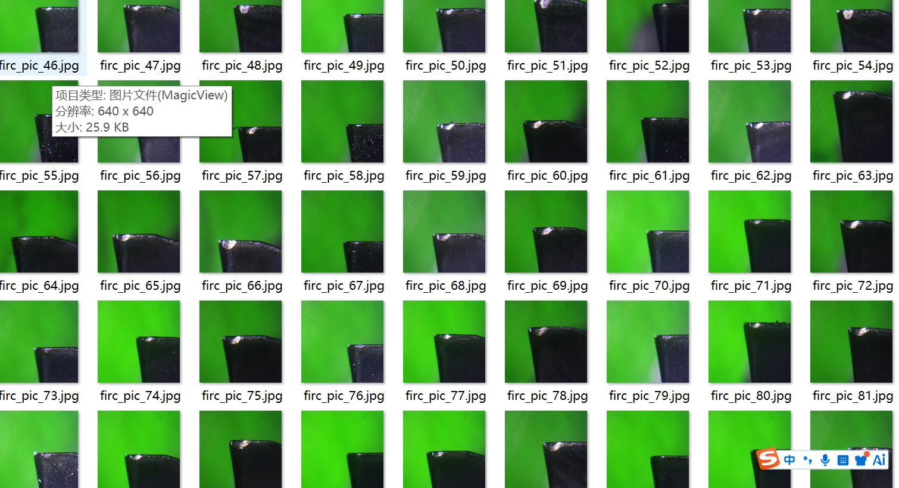
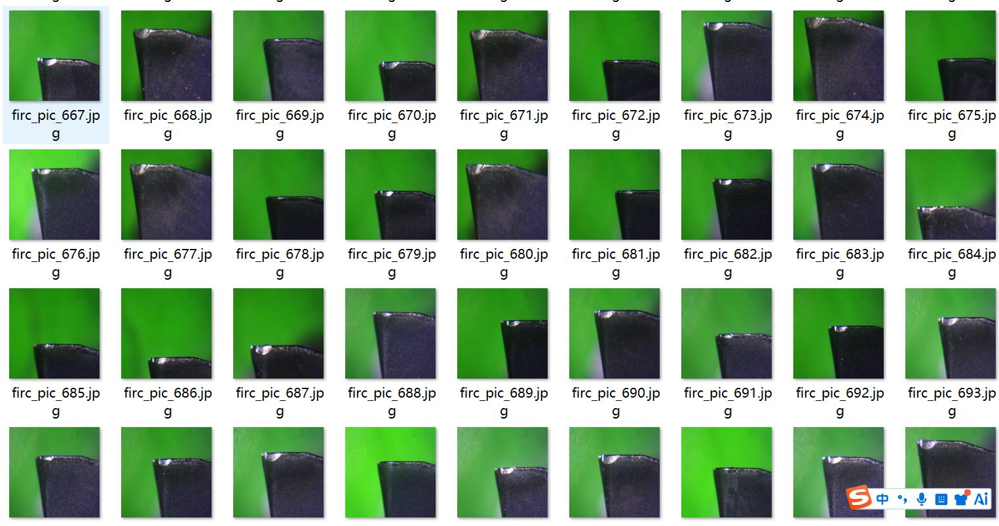
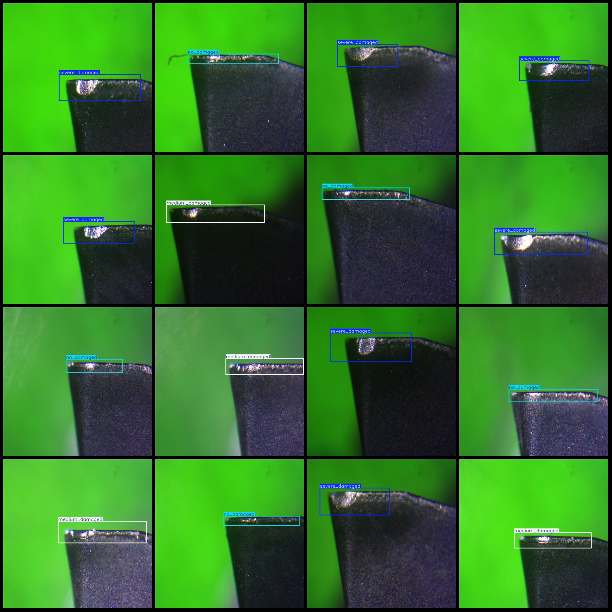
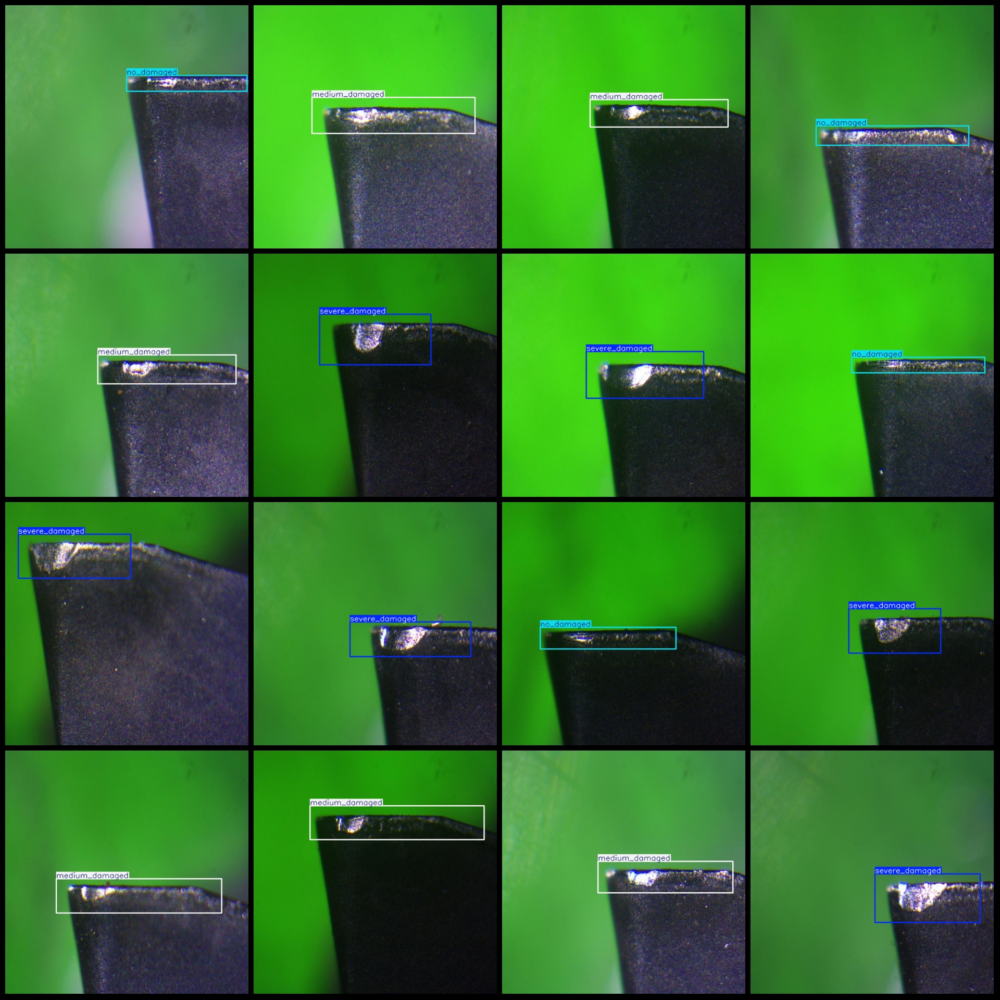

# Micro-milling toolhead wear damage detection dataset in VOC+YOLO format with 804 images and 3 categories

The dataset format is Pascal VOC format + YOLO format (excluding the split path in the txt file, only containing jpeg images and corresponding VOC format xml files and YOLO format txt files).

Number of images (jpg file count): 804
Number of annotations (xml file count): 804
Number of annotations (txt file count): 804
Number of annotation categories: 3
Annotation category names (note that the order of categories in the YOLO format does not correspond to this, but according to the labels folder's classes.txt): ["medium_damaged", "no_damaged", 
"severe_damaged"]

Each category has a specified number of bounding boxes:
- Medium_damaged (moderately damaged) = 269, occupying 269 images
- No_damaged (not damaged) = 234, occupying 234 images
- Severe_damaged (severely damaged) = 301, occupying 301 images

Total bounding box count: 804

Image resolution: 640x640

Annotation tool used: labelImg
Annotation rules: draw bounding boxes for each category

Important note: The dataset does not have been divided into training, validation, or test sets; you need to divide it yourself.

Special declaration: This dataset does not guarantee the accuracy of models trained on it or the weights of the files.

Image preview:
## Images

Here is a pay link on Stripe ( https://buy.stripe.com/3cs8yP7sY87d0vu9AB ). Please contact me lonlonago@foxmail.com after funding $89, and I will send you a complete data files , thank you!

